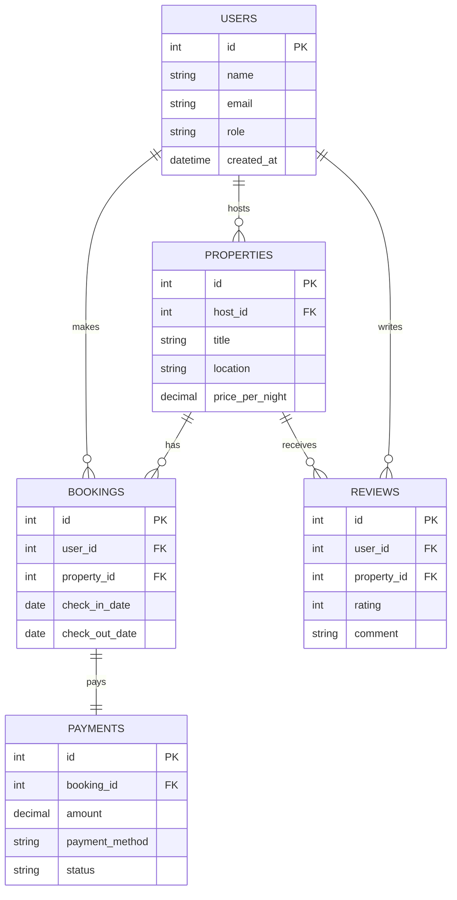
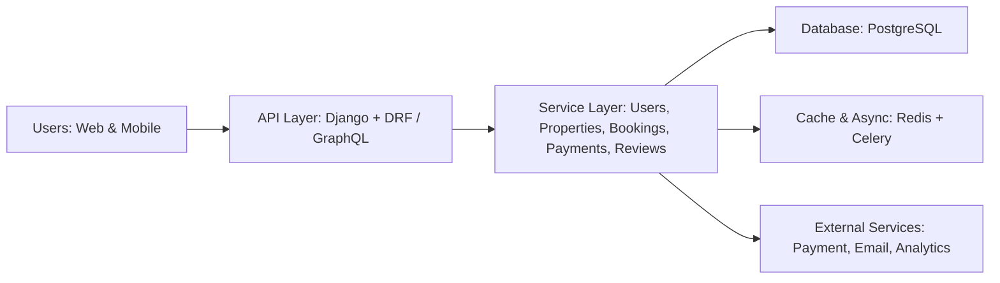

# 🏡 Airbnb Clone Backend

## 📖 Overview

The **Airbnb Clone** project is a full-stack backend application designed to replicate the functionality of the popular Airbnb platform. It focuses on building a **robust, scalable, and secure booking system**, where users can list properties, make reservations, process payments, and leave reviews.

This project emphasizes **backend engineering best practices**, covering topics like API development, database design, CI/CD, and containerized deployment — reflecting a real-world software engineering environment.

---

## 🎯 Project Goals

* **User Management:** Secure registration, authentication, and profile management.
* **Property Management:** Enable property owners (hosts) to create, update, and manage listings.
* **Booking System:** Allow guests to book properties, manage stays, and handle cancellations.
* **Payment Processing:** Integrate payment gateway support for booking transactions.
* **Review System:** Allow users to submit reviews and ratings.
* **Scalability & Optimization:** Leverage caching, indexing, and background jobs for efficiency.
* **API Documentation:** Provide OpenAPI (Swagger) and GraphQL endpoints for developers.

---

## 🧰 Technology Stack

| Category              | Technology                         | Description                                               |
| --------------------- | ---------------------------------- | --------------------------------------------------------- |
| **Backend Framework** | **Django**                         | Python web framework for scalable backend development.    |
| **API Layer**         | **Django REST Framework (DRF)**    | Provides RESTful APIs for CRUD operations.                |
| **Query Language**    | **GraphQL (Graphene-Django)**      | Flexible and efficient data querying layer.               |
| **Database**          | **PostgreSQL**                     | Reliable relational database for storing structured data. |
| **Caching / Queue**   | **Redis + Celery**                 | For caching, async jobs, and background task management.  |
| **Containerization**  | **Docker & Docker Compose**        | Consistent development and production environment.        |
| **CI/CD**             | **GitHub Actions**                 | Automated testing, linting, and deployment pipelines.     |
| **Authentication**    | **JWT (JSON Web Tokens)**          | Secure token-based authentication.                        |
| **Testing**           | **Pytest / Django Test Framework** | Unit and integration testing.                             |

---

## 🏗️ Project Structure

```
airbnb-clone-backend/
│
├── app/
│   ├── users/                # User management module
│   ├── properties/           # Property listings module
│   ├── bookings/             # Booking and reservation module
│   ├── payments/             # Payment and transaction module
│   ├── reviews/              # Review and rating module
│   ├── core/                 # Core utilities, middleware, settings
│   ├── schema/               # GraphQL schema definitions
│   └── manage.py             # Django entry point
│
├── docker/
│   ├── web.Dockerfile        # Dockerfile for Django API
│   ├── redis.Dockerfile      # Optional Redis image customization
│
├── compose/
│   └── docker-compose.yml    # Compose configuration for multi-service setup
│
├── requirements.txt          # Python dependencies
├── .env.example              # Environment variables template
├── .github/
│   └── workflows/
│       └── ci-cd.yml         # GitHub Actions pipeline
│
├── docs/
│   ├── API_REFERENCE.md      # API documentation (OpenAPI / Swagger)
│   ├── SCHEMA.md             # GraphQL schema overview
│   └── SETUP.md              # Setup guide and commands
│
└── README.md                 # Project overview (this file)
```

---

## ⚙️ Setup Instructions

### **1. Clone the Repository**

```bash
git clone https://github.com/<your-username>/airbnb-clone-backend.git
cd airbnb-clone-backend
```

---

### **2. Configure Environment Variables**

Copy the `.env.example` file to `.env`:

```bash
cp .env.example .env
```

Edit your `.env` file with actual credentials:

```env
POSTGRES_DB=airbnb_db
POSTGRES_USER=airbnb_user
POSTGRES_PASSWORD=airbnb_pass
SECRET_KEY=your_django_secret_key
DEBUG=True
ALLOWED_HOSTS=*
REDIS_URL=redis://redis:6379/0
```

---

### **3. Build and Run with Docker**

Ensure Docker and Docker Compose are installed, then run:

```bash
docker-compose up --build
```

This will start:

* Django API service
* PostgreSQL database
* Redis (for caching / Celery)

---

### **4. Run Database Migrations**

After containers are up, run migrations:

```bash
docker-compose exec web python manage.py migrate
```

---

### **5. Create a Superuser**

```bash
docker-compose exec web python manage.py createsuperuser
```

---

### **6. Access the Application**

* **API Root:** [http://localhost:8000/api/](http://localhost:8000/api/)
* **Admin Panel:** [http://localhost:8000/admin/](http://localhost:8000/admin/)
* **GraphQL Playground:** [http://localhost:8000/graphql/](http://localhost:8000/graphql/)

---

### **7. Run Tests**

```bash
docker-compose exec web pytest
```

---

## 📘 Documentation

* **REST API:** `/swagger/` (auto-generated from OpenAPI)
* **GraphQL Endpoint:** `/graphql/`
* **Docs:** See `/docs/` folder for detailed schema and setup notes.

---

## 👥 Team Roles

A well-structured development team ensures smooth collaboration and clear ownership of responsibilities.
The roles below reflect both the project needs and the **recommended team structure** from [ITRexGroup](https://itrexgroup.com/blog/software-development-team-structure/).

| **Role**                                     | **Responsibility**                                                                                                                                                                                                                                           |
| -------------------------------------------- | ------------------------------------------------------------------------------------------------------------------------------------------------------------------------------------------------------------------------------------------------------------ |
| **Backend Developer**                        | Implements core business logic, API endpoints, and database models. Ensures API performance, data integrity, and integration with authentication and payment services. Collaborates with DevOps and QA to maintain code quality and system reliability.      |
| **Database Administrator (DBA)**             | Designs and maintains the database schema (tables, relationships, indexes). Monitors performance, optimizes queries, ensures data consistency, and manages database backups and migrations.                                                                  |
| **DevOps Engineer**                          | Handles deployment, monitoring, and scaling using tools like Docker and GitHub Actions. Maintains CI/CD pipelines, manages environment configuration, and ensures system uptime, scalability, and automation.                                                |
| **QA Engineer**                              | Ensures product quality through automated and manual testing. Verifies business logic, API endpoints, and integrations. Works closely with developers to detect, document, and fix bugs early in the development lifecycle.                                  |
| **Project Lead / Software Architect**        | Oversees the entire technical direction and ensures architectural consistency across modules. Defines coding standards, reviews pull requests, and facilitates team coordination. Balances trade-offs between scalability, performance, and maintainability. |
| **Team Coordinator / GitHub Workflow Owner** | Manages GitHub repositories, branching strategy, and code review processes. Enforces consistent documentation (README, API Docs), organizes sprints, and ensures collaboration between roles.                                                                |

---

### 💡 Additional Notes

* This team structure ensures each component of the project — from backend logic to infrastructure and testing — is owned and optimized by a dedicated specialist.
* According to [ITRexGroup](https://itrexgroup.com/blog/software-development-team-structure/), balanced teams reduce bottlenecks and accelerate delivery by combining complementary expertise across development, QA, and DevOps.

---

## 🧩 Database Design

The database design forms the backbone of the Airbnb Clone platform, enabling efficient data management, relationships, and scalability.
This section outlines the key entities, their core fields, and how they interrelate within the system.

### **1. Users**

Represents individuals interacting with the platform — including guests, hosts, and administrators.
**Key Fields:**

* `id` – Primary key identifying each user.
* `name` – Full name of the user.
* `email` – Unique email address for authentication.
* `role` – Defines user type (guest, host, admin).
* `created_at` – Timestamp of user registration.

**Relationships:**

* A **user** can list multiple **properties**.
* A **user** can make multiple **bookings**.
* A **user** can leave multiple **reviews**.

---

### **2. Properties**

Represents accommodations listed by hosts for booking.
**Key Fields:**

* `id` – Primary key for the property.
* `host_id` – Foreign key referencing the user (host).
* `title` – Title or name of the property.
* `location` – Address or geographical location.
* `price_per_night` – Cost per night for booking.

**Relationships:**

* A **property** belongs to a **user (host)**.
* A **property** can have multiple **bookings** and **reviews**.

---

### **3. Bookings**

Represents reservations made by guests for specific properties.
**Key Fields:**

* `id` – Primary key for the booking.
* `user_id` – Foreign key referencing the guest.
* `property_id` – Foreign key referencing the booked property.
* `check_in_date` – Booking start date.
* `check_out_date` – Booking end date.

**Relationships:**

* A **booking** belongs to one **user (guest)**.
* A **booking** belongs to one **property**.
* A **booking** can have one **payment record**.

---

### **4. Reviews**

Captures user feedback about properties after stays.
**Key Fields:**

* `id` – Primary key for the review.
* `user_id` – Foreign key referencing the reviewer.
* `property_id` – Foreign key referencing the reviewed property.
* `rating` – Numerical rating (e.g., 1–5).
* `comment` – Textual feedback.

**Relationships:**

* A **review** belongs to a **user (guest)**.
* A **review** belongs to a **property**.

---

### **5. Payments**

Tracks payment transactions for confirmed bookings.
**Key Fields:**

* `id` – Primary key for the payment.
* `booking_id` – Foreign key referencing the booking.
* `amount` – Total payment amount.
* `payment_method` – Method used (e.g., card, PayPal).
* `status` – Payment status (e.g., pending, completed, failed).

**Relationships:**

* A **payment** belongs to one **booking**.
* A **booking** can have one **payment**.

---

### **Entity Relationship Summary**

* **User ↔ Property:** One-to-Many (a host can have multiple properties).
* **Property ↔ Booking:** One-to-Many (a property can have multiple bookings).
* **User ↔ Booking:** One-to-Many (a guest can make multiple bookings).
* **Property ↔ Review:** One-to-Many (a property can have multiple reviews).
* **Booking ↔ Payment:** One-to-One (each booking has one payment record).

---

### ERD (Mermaid)



> **Tip:** If your Markdown viewer doesn't render Mermaid, view the diagram on [mermaid.live](https://mermaid.live/) (paste the diagram block there) or enable Mermaid support in your editor.

---

## 🌟 Feature Breakdown

The Airbnb Clone project incorporates a wide range of core functionalities designed to deliver a seamless experience for both guests and hosts. Each feature reflects essential aspects of a real-world booking platform, ensuring scalability, reliability, and ease of use.

### 👤 User Management

This module enables secure user registration, authentication, and profile management. Users can sign up as guests or hosts, update personal information, and manage their activity within the platform. It forms the foundation for all user-related interactions across the system.

### 🏠 Property Management

Hosts can create, update, and delete property listings with detailed descriptions, pricing, and amenities. This feature allows guests to browse, search, and filter properties based on location, price, and preferences, enhancing discoverability and engagement.

### 📅 Booking System

The booking system allows guests to reserve properties for specific dates, ensuring availability through robust validation. It manages the full reservation lifecycle — from booking creation to check-in and check-out — while maintaining consistency across users and properties.

### 💳 Payment Processing

This feature integrates secure payment gateways to handle transactions related to bookings. It ensures that payment records are accurately stored, verified, and linked to their corresponding bookings, enabling a trustworthy and transparent transaction flow.

### ⭐ Review System

After completing their stays, guests can leave reviews and ratings for properties. This fosters trust within the community, helping future guests make informed decisions while enabling hosts to receive feedback and improve their offerings.

### ⚡ Data Optimization & Performance

To enhance responsiveness, the backend implements database indexing, caching, and optimized query handling. These measures ensure that frequently accessed data — such as property listings or booking details — is retrieved efficiently, providing a smooth user experience.

### 🧠 API Documentation

All backend endpoints are documented using the OpenAPI standard, ensuring clear and consistent API specifications. Additionally, GraphQL support allows flexible data queries, empowering developers and clients to retrieve precisely what they need in a single request.

---

## 🏗️ System Architecture

The Airbnb Clone backend is built with a modular, scalable architecture that separates concerns across different layers and services. This design ensures maintainability, performance, and ease of feature expansion.

### Architecture Overview

1. **Client Layer**  
   Users interact with the system via web or mobile clients. Clients send requests to the backend through RESTful API endpoints or GraphQL queries.

2. **API Layer**  
   The Django backend, powered by Django REST Framework (DRF) and GraphQL (Graphene-Django), handles incoming requests. It manages business logic, user authentication, permissions, and data validation.

3. **Service Layer**  
   Contains core modules responsible for the main application features:
   * **User Management** – Handles registration, login, and profile management.
   * **Property Management** – Manages property listings and search functionalities.
   * **Booking System** – Handles reservations, availability checks, and booking lifecycle.
   * **Payment Processing** – Processes transactions securely.
   * **Review System** – Manages property reviews and ratings.

4. **Database Layer**  
   PostgreSQL stores structured data including users, properties, bookings, payments, and reviews. Indexing and optimized queries ensure high performance.

5. **Caching & Async Layer**  
   Redis is used for caching frequently accessed data and session management. Celery handles background tasks such as sending notifications and processing asynchronous payments.

6. **External Integrations**  
   The system can integrate with third-party services such as payment gateways, email services, and analytics platforms, providing additional functionality without compromising core system performance.

### Architecture Diagram (Mermaid)



---

## 🔒 API Security

Security is a critical aspect of the Airbnb Clone backend, ensuring that sensitive data, user interactions, and financial transactions remain protected. The following measures are implemented to safeguard the system:

### **1. Authentication**

All users must authenticate using secure methods before accessing protected endpoints. 

* **Implementation:** JSON Web Tokens (JWT) for stateless authentication.  
* **Importance:** Ensures that only registered users can access their data, preventing unauthorized access to profiles, bookings, or payments.

### **2. Authorization**

Different users have different levels of access based on roles (guest, host, admin).  

* **Implementation:** Role-based access control (RBAC) to restrict actions on resources.  
* **Importance:** Prevents users from performing actions they are not allowed to (e.g., guests cannot modify property listings).

### **3. Rate Limiting**

API requests are monitored and limited to prevent abuse.  

* **Implementation:** Throttling via Django REST Framework’s rate-limiting features.  
* **Importance:** Protects the backend from denial-of-service (DoS) attacks and ensures fair usage for all users.

### **4. Data Validation & Sanitization**

All incoming data is validated to prevent malicious input.  

* **Implementation:** Serializer validation in DRF and input sanitization for forms and queries.  
* **Importance:** Prevents SQL injection, XSS attacks, and ensures the integrity of stored data.

### **5. Secure Payments**

Financial transactions are handled securely with encrypted communication and verified payment gateways.  

* **Implementation:** HTTPS, tokenized payment processing, and secure storage of transaction references (no sensitive card data stored).  
* **Importance:** Protects users’ financial information and ensures trust in the platform.

### **6. Logging & Monitoring**

All security-related events are logged and monitored.  

* **Implementation:** Centralized logging and alerts for suspicious activities.  
* **Importance:** Allows early detection of breaches, audit trails, and compliance with security standards.

---

## 🧩 To Do

* Add CI/CD pipelines with GitHub Actions.
* Deploy to AWS / Render / Railway.
* Implement caching, pagination, and rate limiting.
* Extend GraphQL queries and mutations.